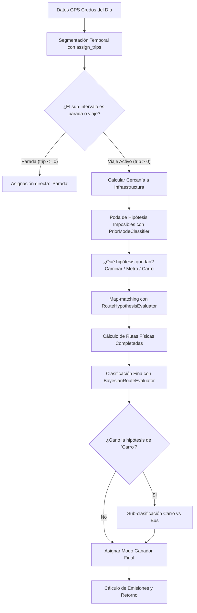

# Explicación del Orchestrator y Clasificación Bayesian (Pipeline v3)

Este documento detalla el funcionamiento del orquestador del pipeline modular de emisiones (`pipeline_v3`) y responde a las preguntas específicas sobre **en qué parte se llama a la clasificación bayesiana**, **dónde se asignan los modos de transporte**, y **cómo se decide con qué hipótesis de ruta correr el algoritmo**.

---

## 1. Arquitectura General del Orquestador

El orquestador principal del pipeline por día se encuentra en el Jupyter Notebook [orchestrator.ipynb](file:///C:/Users/Eydan/OneDrive/Escritorio/ITESM/MAITEC%20Lab/Eventos%20Masivos/GPS_Emissions_Project_Pipeline-v2.0/pipeline_v3/orchestrator.ipynb) bajo la función:

```python
def process_day_wrapper_multi_hypothesis(id_usuario, fecha, df_dia, ...)
```

El flujo general sigue una estrategia **Coarse-to-Fine** (de grueso a fino) para minimizar el costo computacional de realizar map-matching en redes grandes de OpenStreetMap (OSM). A continuación, se muestra el flujo de ejecución por cada día de datos de un usuario:



---

## 2. ¿Cuándo y con qué Hipótesis de Ruta se corre (Poda Coarse)?

El map-matching (`complete_route`) es computacionalmente costoso. Para evitar ruteos innecesarios (por ejemplo, buscar una ruta caminando para un tramo donde el usuario viajó a 80 km/h o buscar metro en zonas donde no hay líneas de metro), el pipeline utiliza una **fase de poda a priori**.

### ¿Cómo se decide con qué hipótesis correr?
En la línea 236 de [orchestrator.ipynb](file:///C:/Users/Eydan/OneDrive/Escritorio/ITESM/MAITEC%20Lab/Eventos%20Masivos/GPS_Emissions_Project_Pipeline-v2.0/pipeline_v3/orchestrator.ipynb):
```python
candidates = prior_classifier.prune_impossible_hypotheses(df_trip, near_subway, near_bus)
```
Esta función pertenece a la clase `PriorModeClassifier` definida en [bayes_classifier.py](file:///C:/Users/Eydan/OneDrive/Escritorio/ITESM/MAITEC%20Lab/Eventos%20Masivos/GPS_Emissions_Project_Pipeline-v2.0/pipeline_v3/src/bayes_classifier.py#L32).

La lógica de decisión de hipótesis es la siguiente:
1. **Caminar**: Se agrega como hipótesis si la velocidad máxima de la trayectoria cruda es $\le 22\text{ km/h}$ y la distancia lineal total del viaje es $\le 15\text{ km}$.
2. **Metro**: Se agrega como hipótesis únicamente si el usuario pasó cerca de alguna línea de metro (`near_subway.any()`) y la distancia lineal total es $> 1.0\text{ km}$.
3. **Motorizado Vial (Carro / Bus)**: Se agrega (representado como la hipótesis de red `'Carro'`) si la velocidad máxima es $> 3\text{ km/h}$ o la distancia lineal es $> 0.5\text{ km}$.

> [!IMPORTANT]
> **Nota de Optimización Clave**:
> El modo `'Bus'` **no se rutea de manera independiente**. Debido a que tanto los carros como los autobuses transitan por la misma red vial motorizada (`G_drive`), hacer map-matching para ambos duplicaría el coste computacional. Por lo tanto, el orquestador solo realiza el ruteo físico bajo el candidato genérico **`'Carro'`** y delega la separación entre Carro y Bus al paso posterior.

---

## 3. ¿Dónde se realiza la Clasificación Bayesiana?

El pipeline implementa la inferencia bayesiana en dos niveles distintos:

### A. Prior Bayesiano Heurístico (Opcional/Conceptual - ELIMINADO)
*Nota: Este método (`PriorModeClassifier.generate_mode_priors`) existía de forma conceptual pero se eliminó del módulo [bayes_classifier.py](file:///C:/Users/Eydan/OneDrive/Escritorio/ITESM/MAITEC%20Lab/Eventos%20Masivos/GPS_Emissions_Project_Pipeline-v2.0/pipeline_v3/src/bayes_classifier.py) para evitar confusiones, manteniendo un flujo limpio de dos etapas puras (Poda de hipótesis + Clasificación final por matrices).*

### B. Inferencia Bayesiana Posterior (Clasificación Fina de Ruta)
Se ejecuta en la línea 242 de [orchestrator.ipynb](file:///C:/Users/Eydan/OneDrive/Escritorio/ITESM/MAITEC%20Lab/Eventos%20Masivos/GPS_Emissions_Project_Pipeline-v2.0/pipeline_v3/orchestrator.ipynb):
```python
best_mode, best_df, best_prob, diagnostic_probs = scorer.select_final_mode(hypotheses, subway_routes, bus_routes)
```
Donde `scorer` es una instancia de `BayesianRouteEvaluator`. 

Esta fase funciona de la siguiente manera:
1. Recibe el diccionario `hypotheses` que contiene los DataFrames ruteados reales (ej. `{'Caminar': df_walk_routed, 'Carro': df_drive_routed}`).
2. Llama internamente a `evaluate_completed_route_with_matrices(...)` para evaluar cada ruta física calculada contra las matrices de probabilidad condicional del paper científico original:
   * **`Cercania`**: Evalúa si los puntos ruteados están cerca del metro (peso hacia Metro), autobús (peso hacia Bus) o en la red vial general.
   * **`Velocidad`**: Clasifica las velocidades instantáneas corregidas en calle en rangos ($\le 6\text{ km/h}$, $6-20\text{ km/h}$, $20-80\text{ km/h}$, $> 80\text{ km/h}$).
   * **`Distancia`**: Clasifica la distancia física total acumulada del viaje ruteado.
   * **`Velprom`**: Clasifica la velocidad promedio total del viaje.
3. Multiplica vectorialmente las probabilidades por cada ping GPS de la ruta y las normaliza para obtener una votación de viaje.
4. Selecciona el modo cuya hipótesis de ruta propia arroje la **máxima probabilidad a posteriori** (`prob_self`).

---

## 4. ¿Dónde y Cómo se Asignan los Modos?

Los modos se asignan en tres partes bien diferenciadas dentro del ciclo de procesamiento de viajes en el orquestador:

| Modo de Transporte | Condición de Asignación | Dónde se Asigna en el Código | Método/Variable |
| :--- | :--- | :--- | :--- |
| **`'Parada'`** | Pings que pertenecen a intervalos de quietud (`trip <= 0`) segmentados por el filtro de paso bajo. | [orchestrator.ipynb: L216](file:///C:/Users/Eydan/OneDrive/Escritorio/ITESM/MAITEC%20Lab/Eventos%20Masivos/GPS_Emissions_Project_Pipeline-v2.0/pipeline_v3/orchestrator.ipynb#L216) | Asignación estática directa en el DataFrame temporal de paradas. |
| **`'Caminar'`** | Gana en la votación Bayesiana de rutas (`best_mode == 'Caminar'`). | [orchestrator.ipynb: L242](file:///C:/Users/Eydan/OneDrive/Escritorio/ITESM/MAITEC%20Lab/Eventos%20Masivos/GPS_Emissions_Project_Pipeline-v2.0/pipeline_v3/orchestrator.ipynb#L242) | Retornado directamente por `scorer.select_final_mode()`. |
| **`'Metro'`** | Gana en la votación Bayesiana de rutas (`best_mode == 'Metro'`). | [orchestrator.ipynb: L242](file:///C:/Users/Eydan/OneDrive/Escritorio/ITESM/MAITEC%20Lab/Eventos%20Masivos/GPS_Emissions_Project_Pipeline-v2.0/pipeline_v3/orchestrator.ipynb#L242) | Retornado directamente por `scorer.select_final_mode()`. |
| **`'Carro'`** | Gana la hipótesis vial motorizada y no se detectan características de autobús. | [orchestrator.ipynb: L242](file:///C:/Users/Eydan/OneDrive/Escritorio/ITESM/MAITEC%20Lab/Eventos%20Masivos/GPS_Emissions_Project_Pipeline-v2.0/pipeline_v3/orchestrator.ipynb#L242) | Retornado por `scorer.select_final_mode()` tras verificar la sub-clasificación. |
| **`'Bus'`** | Gana la hipótesis vial motorizada (`'Carro'`) pero la sub-clasificación detecta un patrón de autobús. | [bayes_classifier.py: L321-326](file:///C:/Users/Eydan/OneDrive/Escritorio/ITESM/MAITEC%20Lab/Eventos%20Masivos/GPS_Emissions_Project_Pipeline-v2.0/pipeline_v3/src/bayes_classifier.py#L321-L326) | Modificado dinámicamente en `select_final_mode` si `_resolve_car_vs_bus` retorna `'Bus'`. |

### Sub-clasificación Carro vs. Bus (Discriminación Vial)
Si la hipótesis de ruta ganadora es `'Carro'`, se ejecuta `_resolve_car_vs_bus(...)` en [bayes_classifier.py: L276](file:///C:/Users/Eydan/OneDrive/Escritorio/ITESM/MAITEC%20Lab/Eventos%20Masivos/GPS_Emissions_Project_Pipeline-v2.0/pipeline_v3/src/bayes_classifier.py#L276). Tras los últimos cambios solicitados, la decisión es **100% Bayesiana pura basada en las matrices**:
* El modo se sobreescribe a **`'Bus'`** únicamente si la probabilidad condicional acumulada para `'Bus'` en las matrices es estrictamente mayor que la de `'Carro'` (`prob_vector_road['Bus'] > prob_vector_road['Carro']`). Se eliminaron por completo las reglas heurísticas adicionales de solapamiento físico (`overlap_fraction`) y velocidad promedio (`avg_speed`) para respetar estrictamente la inferencia probabilística pura.

---

## 5. Resumen del Flujo de Ejecución del Viaje Activo

```python
# 1. PODA (Coarse check)
candidates = prior_classifier.prune_impossible_hypotheses(df_trip, near_subway, near_bus)
# candidates = ['Caminar', 'Carro']

# 2. RUTEO (Physical matching)
hypotheses = evaluator.evaluate(id_usuario, df_trip, candidates)
# hypotheses = {'Caminar': df_walk_routed, 'Carro': df_drive_routed}

# 3. CLASIFICACIÓN BAYESIANA FINAL & DISCRIMINACIÓN CARRO vs BUS
best_mode, best_df, best_prob, diagnostic_probs = scorer.select_final_mode(hypotheses, subway_routes, bus_routes)
# Retorna, por ejemplo: 'Bus', df_drive_routed (con modo cambiado a 'Bus'), 0.88
```
