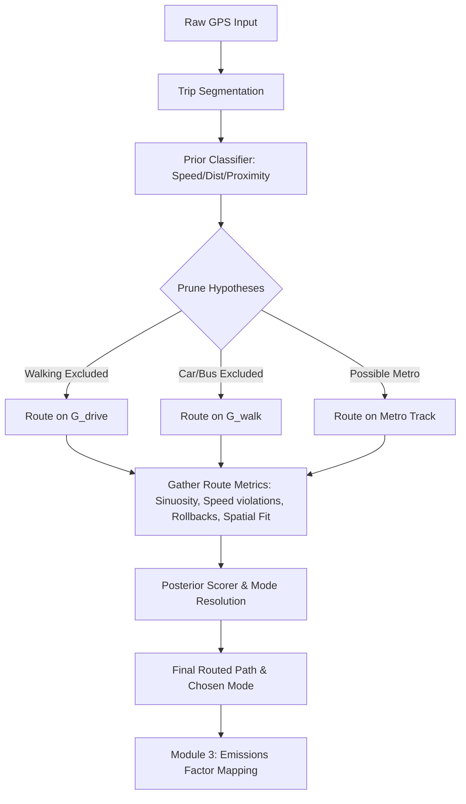

# GPS Emissions Refactor Analysis: Resolving Modal and Routing Dependencies

This document provides a deep technical analysis of the circular dependency between modal classification and map-matching routing, evaluates the proposed multi-hypothesis routing idea, presents a target architecture, and outlines a migration plan with code-level changes.

---

## 1. Codebase Inspection & Circular Dependency Identification

In the current codebase, the pipeline is executed in a sequential, top-down order inside [process_day_wrapper](file:///C:/Users/Eydan/OneDrive/Escritorio/ITESM/MAITEC%20Lab/Eventos%20Masivos/GPS_Emissions_Project_Pipeline-v2.0/scratch/extracted/m2_execution.py#L12-L65):
1. **Trip Segmentation**: [assign_trips](file:///C:/Users/Eydan/OneDrive/Escritorio/ITESM/MAITEC%20Lab/Eventos%20Masivos/GPS_Emissions_Project_Pipeline-v2.0/scratch/extracted/m2_functions.py#L16-L115) partitions coordinate trajectories into stationary stops (`trip <= 0`) and movement phases (`trip > 0`).
2. **Transportation Mode Classification**: [calcular_cercania_infraestructura](file:///C:/Users/Eydan/OneDrive/Escritorio/ITESM/MAITEC%20Lab/Eventos%20Masivos/GPS_Emissions_Project_Pipeline-v2.0/scratch/extracted/m1_functions.py#L3-L23) computes geographic proximity to transit infrastructure, and [clasificar_viajes](file:///C:/Users/Eydan/OneDrive/Escritorio/ITESM/MAITEC%20Lab/Eventos%20Masivos/GPS_Emissions_Project_Pipeline-v2.0/scratch/extracted/m1_functions.py#L25-L95) uses a Bayesian framework to vote on a single trip-level mode.
3. **Map Matching / Routing**: [complete_route](file:///C:/Users/Eydan/OneDrive/Escritorio/ITESM/MAITEC%20Lab/Eventos%20Masivos/GPS_Emissions_Project_Pipeline-v2.0/scratch/extracted/m2_functions.py#L549-L1010) completes the path on a network selected by the assigned mode.

### Functions/Classes Assuming Mode is Known
* **[complete_route](file:///C:/Users/Eydan/OneDrive/Escritorio/ITESM/MAITEC%20Lab/Eventos%20Masivos/GPS_Emissions_Project_Pipeline-v2.0/scratch/extracted/m2_functions.py#L549-L1010)**:
  Extracts the mode inside the map-matching loop:
  ```python
  modo_actual = modos_arr[origen_idx]
  ```
  It branches key routing rules based on `modo_actual`:
  * **Network Selection** (lines 679-682):
    ```python
    es_peaton = (str(modo_actual).lower() == 'caminar')
    G_actual = G_walk if es_peaton else G_drive
    ig_actual = ig_walk if es_peaton else ig_drive 
    map_actual = map_walk if es_peaton else map_drive 
    ```
  * **Metro Bypass Snapping** (lines 633-675):
    If the mode is `'Metro'`, it skips the graph search entirely and projects points onto the transit line shapefile using `_obtener_tramo_metro(...)`.
  * **Velocity Constraints & Rollbacks** (lines 587-588, 806-840):
    Speed thresholds restrict the shortest-path candidates and validate physical feasibility:
    ```python
    limites_kmh = {'Caminar': 22.0, 'Bus': 100, 'Metro': 100.0, 'Carro': 150.0, 'Parada': 4.0}
    limites_kmhlazy = {'Caminar': 4.5, 'Bus': 20.0, 'Metro': 35.0, 'Carro': 35.0, 'Parada': 3.0}
    ```
    If a segment is routed and exceeds these limits, the candidate is discarded or a rollback (`strikes` count) is triggered.

### Data Structures Carrying Mode Into Routing
The mode is passed as a string column `'modo_transporte'` in the `registros_person` DataFrame. Values are: `'Carro'`, `'Bus'`, `'Metro'`, `'Caminar'`, or `'Parada'`.

### What Breaks if Mode is Unknown or Probabilistic?
* **Network Querying**: Graph routing requires an explicit, single graph object (`G_walk` or `G_drive`). If the mode is probabilistic (e.g. 70% drive, 30% walk), map-matching cannot query "both networks at once" in a single igraph search.
* **Physics Check Failures**: Speed limits are highly mode-dependent. A speed of 40 km/h is normal for driving but physically impossible for walking. Without a resolved mode, any unified physics checker would either fail to filter impossible trajectories or incorrectly discard motorized segments.
* **Emissions Constraints**: [m3_emissions.py](file:///C:/Users/Eydan/OneDrive/Escritorio/ITESM/MAITEC%20Lab/Eventos%20Masivos/GPS_Emissions_Project_Pipeline-v2.0/scratch/extracted/m3_emissions.py#L51-L57) maps modes directly to MOVES Source IDs (Car = 21, Bus = 42, Non-Motorized/Stops = 0). If the mode is unresolved or mixed at the trip-level, emissions factors cannot be calculated unless a single mode is selected for each segment.

### Reusable Components
* **Candidate lookup**: [get_candidates_vectorized](file:///C:/Users/Eydan/OneDrive/Escritorio/ITESM/MAITEC%20Lab/Eventos%20Masivos/GPS_Emissions_Project_Pipeline-v2.0/scratch/extracted/m2_candidates.py#L5-L53) extracts spatial nodes for both `drive` and `walk` networks. This works independently of the classified mode and can be reused directly.
* **Graph shortest path loops**: The routing internals in `complete_route` (snapping, Dijkstra searches, adaptive lookahead skips, time allocations, rollbacks) are generic and work for any network graph, given a set of speed constraints.
* **Metro Track Snapping**: `_obtener_tramo_metro` is decoupled and can be wrapped as a specific metro routing hypothesis.

---

## 2. Evaluation of Multi-Hypothesis Routing

### Feasibility
Running multiple routing hypotheses per trip is mathematically sound and highly feasible. By routing each trip on the road network (`Carro`/`Bus`), the pedestrian network (`Caminar`), and the transit network (`Metro`), we can gather routing metrics (completion rates, speed compliance) to use as inputs for a more defensible classification.

### Computational & Architectural Risks

| Risk Dimension | Details | Mitigation |
| :--- | :--- | :--- |
| **Computational Explosion** | Routing a motorized trip (e.g., 80 km/h on a highway) on the pedestrian network (`G_walk`) will cause continuous speed violations. The algorithm will loop, pop nodes, and repeatedly attempt backtracking/rollbacks (up to 20 strikes), causing routing times to spike exponentially. | **Early Pruning**: Instantly reject the walking hypothesis if any raw GPS points show speed > 25 km/h or if the trip distance > 10 km. |
| **Identical Geometries (Car vs. Bus)** | Both Car and Bus route on the identical `G_drive` network. Evaluating them strictly on spatial routing metrics yields identical route geometries and fit scores. | **Post-Routing Contextual Scoring**: Use proximity to bus lines, schedule temporal checks, and stop frequencies to differentiate them. |
| **Fragmented / Incomplete Routes** | When a routing network is mismatched (e.g. walking routed on a highway), routing fails, producing mostly `POINT` geometries (spatial skips) instead of continuous `LINESTRING` paths. | **Standardized Score Mapping**: Treat the proportion of successfully matched segments (vs. points) as a direct routing quality metric. |

---

## 3. Target Architecture: Hierarchical Coarse-to-Fine Classifier with Progressive Hypothesis Elimination

We propose an architecture that uses a **Prior Mode Classifier** to estimate mode probabilities, prunes implausible hypotheses, routes only the remaining candidates, and uses a **Posterior Route Scorer** to resolve the final mode and path.



### Advantages of the Recommended Architecture
1. **Methodological Defensibility**: Prior probabilities derived from raw GPS are updated with topological evidence (network connectivity, physical speed limits), resolving the circular dependency.
2. **Acceptable Runtime**: By early-filtering walking or metro hypotheses (e.g. walk is rejected if max speed > 25 km/h), 80%+ of trips will only route on a single network, avoiding compute overhead.
3. **Compatibility**: The final output is structured identical to the current `complete_route` output, ensuring zero breakages in Module 3.

---

## 4. Migration Plan

### Phase 1: Minimal-Change Prototype
* Create a simplified prior filter in [process_day_wrapper](file:///C:/Users/Eydan/OneDrive/Escritorio/ITESM/MAITEC%20Lab/Eventos%20Masivos/GPS_Emissions_Project_Pipeline-v2.0/scratch/extracted/m2_execution.py#L12-L65).
* Loop over plausible hypotheses, calling the existing `complete_route` by passing a mocked `'modo_transporte'` column.
* Select the winning hypothesis based on route completion rate (ratio of successfully matched segments vs. point fallbacks).
* Verify compatibility with [m3_emissions.py](file:///C:/Users/Eydan/OneDrive/Escritorio/ITESM/MAITEC%20Lab/Eventos%20Masivos/GPS_Emissions_Project_Pipeline-v2.0/scratch/extracted/m3_emissions.py#L1-L139).

### Phase 2: Medium Refactor
* Formally extract hypothesis generation and early pruning rules into a dedicated module.
* Refactor `complete_route` to accept explicit speed limits and networks as parameters instead of reading them from the DataFrame.
* Store and return diagnostic metrics for each evaluated route (e.g., number of rollbacks, speed compliance, distance ratio).

### Phase 3: Robust Final Architecture
* Implement fallback logic for edge cases where all hypotheses fail (e.g., fallback to linear interpolation labeled as "Unknown/Mixed Mode" to ensure emissions can still be estimated).
* Expose diagnostic logs to save quality metrics for each trip.

---

## 5. Proposed Skeletons & Code-Level Changes

### 1. Prior Classifier and Early Rejection Heuristics
```python
class PriorModeClassifier:
    """
    Clasificador de Prior Modal y Heurísticas de Filtrado.
    Calcula priors heurísticos y realiza el descarte/poda de hipótesis imposibles
    utilizando variables baratas derivadas directamente del GPS crudo (sin ruteo).
    """
    def __init__(self, max_walk_speed=25.0, max_walk_dist=12.0):
        self.max_walk_speed = max_walk_speed
        self.max_walk_dist = max_walk_dist

    def generate_mode_priors(self, df_trip, near_subway, near_bus):
        """
        Calcula una distribución de probabilidad a priori simplificada para cada modo.
        """
        # (Heuristic code here...)
        pass

    def prune_impossible_hypotheses(self, df_trip, near_subway, near_bus):
        """
        Poda (filtra) hipótesis imposibles para ahorrar costes de ruteo.
        """
        # Calculate raw statistics
        max_speed = df_trip['Speed [km/h]'].max()
        total_dist_km = df_trip['dis lineal [m]'].sum() / 1000.0
        
        candidates = []
        
        # 1. Walking checks
        if max_speed <= self.max_walk_speed and total_dist_km <= self.max_walk_dist:
            candidates.append('Caminar')
            
        # 2. Metro checks
        if near_subway.any() and total_dist_km > 1.0:
            candidates.append('Metro')
            
        # 3. Motorized checks (Carro / representing road_motorized)
        if max_speed > 3.0 or total_dist_km > 0.5:
            candidates.append('Carro')
            
        # Fallback to prevent empty candidate lists
        if not candidates:
            candidates = ['Carro']
            
        return candidates
```

### 2. Hypothesis Evaluator and Routing Runner
```python
class RouteHypothesisEvaluator:
    """
    Routes a trip under multiple mode hypotheses and gathers diagnostic metrics.
    """
    def __init__(self, G_drive, G_walk, ig_drive, ig_walk, map_drive, map_walk, geometry_metro):
        self.networks = {
            'Carro': (G_drive, ig_drive, map_drive),
            'Caminar': (G_walk, ig_walk, map_walk)
        }
        self.geometry_metro = geometry_metro

    def evaluate(self, id_user, df_trip, mode_candidates):
        hypotheses = {}
        
        for mode in mode_candidates:
            if mode == 'Metro':
                # Special snapping logic for metro
                df_mock = df_trip.copy()
                df_mock['modo_transporte'] = 'Metro'
                df_routed = complete_route(
                    id_user, df_mock, 
                    self.networks['Carro'][0], self.networks['Caminar'][0],
                    self.networks['Carro'][1], self.networks['Caminar'][1],
                    self.networks['Carro'][2], self.networks['Caminar'][2],
                    self.geometry_metro
                )
                hypotheses['Metro'] = df_routed
            else:
                # Standard network routing (Carro or Caminar)
                df_mock = df_trip.copy()
                df_mock['modo_transporte'] = mode
                G, ig, network_map = self.networks[mode]
                df_routed = complete_route(
                    id_user, df_mock,
                    G, self.networks['Caminar'][0],
                    ig, self.networks['Caminar'][1],
                    network_map, self.networks['Caminar'][2],
                    self.geometry_metro
                )
                hypotheses[mode] = df_routed
                
        return hypotheses
```

### 3. Posterior Bayesian Classifier with Route Evidence
```python
class BayesianRouteEvaluator:
    """
    Evaluates each candidate route hypothesis through the research paper's 
    Bayesian matrices using high-fidelity routed features.
    """
    def __init__(self):
        # Original matrices from research paper (Module 1)
        self.modos = ['Carro', 'Bus', 'Metro', 'Caminar']
        
        self.Cercania = np.array([
            [0.10, 0.10, 0.80, 0.00],  # Close to subway
            [0.10, 0.80, 0.00, 0.10],  # Close to bus route
            [0.40, 0.25, 0.05, 0.30]   # No infrastructure near
        ])

        self.Velocidad = np.array([
            [0.05, 0.10, 0.15, 0.60],  # Speed <= 6.0 km/h
            [0.47, 0.38, 0.05, 0.10],  # 6.0 < Speed <= 20.0 km/h
            [0.50, 0.30, 0.20, 0.00],  # 20.0 < Speed <= 80.0 km/h
            [1.00, 0.00, 0.00, 0.00]   # Speed > 80.0 km/h
        ])

        self.Distancia = np.array([
            [0.10, 0.20, 0.30, 0.40],  # Dist <= 1.0 km
            [0.25, 0.25, 0.30, 0.20],  # 1.0 < Dist <= 6.0 km
            [0.40, 0.15, 0.25, 0.20],  # 6.0 < Dist <= 10.0 km
            [0.60, 0.30, 0.00, 0.10],  # 10.0 < Dist <= 18.0 km
            [0.40, 0.40, 0.00, 0.20]   # Dist > 18.0 km
        ])

        self.Velprom = np.array([
            [0.10, 0.10, 0.20, 0.60],  # Avg speed <= 6.0 km/h
            [0.40, 0.25, 0.25, 0.10]   # Avg speed > 6.0 km/h
        ])

    def evaluate_completed_route_with_matrices(self, df_routed, mode_hypothesis, subway_routes, bus_routes):
        """
        Feeds a completed routed hypothesis DataFrame through the Bayesian matrices.
        """
        if df_routed.empty:
            return pd.Series([0.0, 0.0, 0.0, 0.0], index=self.modos)

        # Proximity calculation is done on the routed path
        df_eval = df_routed.copy()
        df_eval = calcular_cercania_infraestructura(df_eval, subway_routes, bus_routes)

        # 1. Index 1: Infrastructure proximity (Cercanía)
        idx_c = np.where(df_eval['near_subway_line'] == 1, 0,
                np.where(df_eval['near_bus_route'] == 1, 1, 2))

        # 2. Index 2: Point Speed Bins (Velocidad)
        idx_v = np.digitize(df_eval['Speed [km/h]'].fillna(0), bins=[6.001, 20.001, 80.001])

        # 3. Index 3: Total Trip Distance Bins (Distancia)
        total_dist_km = df_eval['distance_m'].sum() / 1000.0
        idx_d = np.digitize([total_dist_km], bins=[1.0, 6.001, 10.001, 18.001])[0]
        idx_d_arr = np.repeat(idx_d, len(df_eval))

        # 4. Index 4: Average Trip Speed Bins (Velprom)
        avg_speed_trip = df_eval['Speed [km/h]'].mean()
        idx_vp = np.digitize([avg_speed_trip], bins=[6.001])[0]
        idx_vp_arr = np.repeat(idx_vp, len(df_eval))

        # 5. Compute point-level unnormalized probabilities
        P_unnorm = (self.Cercania[idx_c] * 
                    self.Velocidad[idx_v] * 
                    self.Distancia[idx_d_arr] * 
                    self.Velprom[idx_vp_arr])

        # 6. Point-level Normalization
        suma_puntos = P_unnorm.sum(axis=1, keepdims=True)
        suma_puntos[suma_puntos == 0] = 1
        P_norm = P_unnorm / suma_puntos

        # 7. Aggregate probabilities across the trip (Bayesian voting)
        total_votes = P_norm.sum(axis=0)
        total_votes_normalized = total_votes / (total_votes.sum() + 1e-9)
        
        return pd.Series(total_votes_normalized, index=self.modos)

    def _resolve_car_vs_bus(self, df_routed, subway_routes, bus_routes):
        """
        Sub-classification step to differentiate Car vs Bus for the road_motorized network.
        """
        df_eval = df_routed.copy()
        df_eval = calcular_cercania_infraestructura(df_eval, subway_routes, bus_routes)
        
        prob_vector_road = self.evaluate_completed_route_with_matrices(df_eval, 'Carro', subway_routes, bus_routes)
        avg_speed = df_eval['Speed [km/h]'].mean()
        overlap_fraction = df_eval['near_bus_route'].mean()
        
        if prob_vector_road['Bus'] > prob_vector_road['Carro'] or (overlap_fraction > 0.6 and avg_speed < 30.0):
            return 'Bus'
        else:
            return 'Carro'

    def select_final_mode(self, hypotheses, subway_routes, bus_routes):
        """
        Compares all completed route hypotheses and selects the best one.
        """
        best_mode = None
        best_probability = -1.0
        best_df = None
        diagnostic_probs = {}

        for mode, df_routed in hypotheses.items():
            prob_vector = self.evaluate_completed_route_with_matrices(df_routed, mode, subway_routes, bus_routes)
            prob_self = prob_vector[mode]
            diagnostic_probs[mode] = prob_vector.to_dict()
            
            if prob_self > best_probability:
                best_probability = prob_self
                best_mode = mode
                best_df = df_routed

        # Sub-classify Car vs Bus if road network wins
        if best_mode == 'Carro' and 'Carro' in hypotheses:
            resolved_mode = self._resolve_car_vs_bus(hypotheses['Carro'], subway_routes, bus_routes)
            if resolved_mode == 'Bus':
                best_mode = 'Bus'
                best_df = best_df.copy()
                best_df['modo_transporte'] = 'Bus'
                
        return best_mode, best_df, best_probability, diagnostic_probs
```

### 4. Integration into wrapper
```python
def process_day_wrapper_v2(id_usuario, fecha, df_dia, G_drive_arg, G_walk_arg, ig_drive_arg, ig_walk_arg, map_drive_arg, map_walk_arg, subway_routes_proj_arg):
    if df_dia.empty:
        return pd.DataFrame()

    df_dia = assign_trips(df_dia)
    df_dia = calcular_cercania_infraestructura(df_dia, subway_routes, bus_routes)
    
    prior_classifier = PriorModeClassifier()
    evaluator = RouteHypothesisEvaluator(G_drive_arg, G_walk_arg, ig_drive_arg, ig_walk_arg, map_drive_arg, map_walk_arg, subway_routes_proj_arg)
    scorer = BayesianRouteEvaluator()
    
    all_routed_trips = []
    
    # Process trip by trip
    for trip_id, df_trip in df_dia.groupby('trip'):
        if trip_id <= 0:
            # Handle Stops/Paradas directly without map-matching
            df_stop = df_trip.copy()
            df_stop['modo_transporte'] = 'Parada'
            # Format to match completed route output
            df_stop_routed = pd.DataFrame({
                'caid': id_usuario, 'trip': trip_id,
                'latitude': df_stop['latitude'], 'longitude': df_stop['longitude'],
                'Speed [km/h]': 0.0, 'local_timestamp': df_stop['local_timestamp'],
                'start_node': 'N/A', 'end_node': 'N/A', 'osmid': 'N/A', 'highway': 'parada_inactiva',
                'geometry': [f'POINT ({lon} {lat})' for lon, lat in zip(df_stop['longitude'], df_stop['latitude'])],
                'distance_m': 0.0, 'modo_transporte': 'Parada',
                'ruteo_fallido': False, 'corregido_espacialmente': False, 'flag_auditoria': 'None'
            })
            all_routed_trips.append(df_stop_routed)
            continue
            
        # Prior candidates classification (pruning impossible hypotheses)
        near_subway = df_trip['near_subway_line']
        near_bus = df_trip['near_bus_route']
        candidates = prior_classifier.prune_impossible_hypotheses(df_trip, near_subway, near_bus)
        
        # Route candidates
        hypotheses = evaluator.evaluate(id_usuario, df_trip, candidates)
        
        # Scoring & Selection via Bayesian matrices using routed features (select final mode)
        best_mode, best_df, best_prob, diagnostic_probs = scorer.select_final_mode(hypotheses, subway_routes, bus_routes)
        all_routed_trips.append(best_df)
        
    df_routed_day = pd.concat(all_routed_trips, ignore_index=True)
    return df_routed_day
```

---

## 6. Testing & Diagnostics Plan

To validate the refactored architecture, the following test scenarios should be established:

### Test Scenarios
1. **Synthetic Clean Trips**: Construct perfect coordinate chains along known OSM highways with simulated speeds of 50 km/h (Car) and 4 km/h (Walk). Verify that the prior classifier accurately prunes mismatched modes and the scorer selects the correct network.
2. **High-Noise GPS Trips**: Add Gaussian noise ($\sigma = 30$ meters) to a known walk trajectory. The walk routing should trigger rollbacks and skips, but the prior classifier should still exclude driving, verifying that noise does not cause computational explosion on wrong graphs.
3. **Metro Tunnel Outages**: Simulate a metro trip where coordinates disappear in tunnels and reappear near subway stations. Test that the metro hypothesis evaluates successfully and is chosen over the road routing network.
4. **Mixed-Mode Trajectories**: Simulate a trip consisting of 5 minutes walking, 15 minutes driving, and 5 minutes walking. Since the segmenter treats this as a single trip, verify how the scorer handles the conflict and confirm that it defaults to the highest-scoring motorized option.

### Quantitative Comparison Metrics
* **Routing Success Rate**: Compare the percentage of points routed without falling back to "Rendición/Spatial Skip" between the old and new pipelines.
* **Execution Time (sec/trip)**: Monitor performance metrics across 100 sample users to ensure early-pruning prevents computational overhead.
* **Emissions Consistency**: Verify that total emitted grams of $CO_2$, $NO_x$, and $PM_{2.5}$ are within $\pm 5\%$ of the original pipeline outputs for clean, high-confidence trips.
