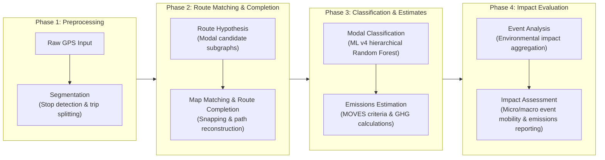

# GPS Trajectory Processing and Emissions Estimation Pipeline

This repository contains a modular Python-based pipeline designed to preprocess raw GPS trajectory datasets, perform map-matching routing on urban road networks, classify transportation modes, estimate criteria pollutant and greenhouse gas (GHG) emissions, and quantify the multi-scale (micro/macro) environmental and mobility impact of massive public events.

## Pipeline Overview

The workflow processes spatial-temporal GPS pings through the following sequential stages:



## Repository Structure

```
├── pipeline_v3/
│   ├── orchestrator.ipynb         # Main Jupyter notebook executing the modular workflow
│   ├── src/                       # Modular Python source code
│   │   ├── config.py              # Relative path and filesystem configurations
│   │   ├── segmentation.py        # Downsampling, geofencing, and trip partitioning
│   │   ├── routing.py             # Map-snapping, candidate generation, and network routing (Scenario 8 calibration)
│   │   ├── modal_classification.py # Prior/posterior classification and infrastructure proximity
│   │   └── emissions.py           # MOVES emission factor matching and calculations
│   └── calibration_and_diagnostics/ # Subsystem for routing calibration, survey depuration, and bayesian tuning
│       ├── routing_algorithm_calibration/ # GPS sensitivity analysis and optimal parameters identification
│       ├── gps_survey_data_cleaning/     # Automated parsing and cleaning of manual MATLAB survey records
│       └── modal_classification/         # Notebooks and calibration for modal classification
│           ├── bayesian_calibration/      # Bayesian matrices calibration using Optuna
│           └── random_forest_calibration/  # Random Forest hierarchical model training and diagnostics
├── legacy/                        # Legacy or baseline pipeline notebooks (e.g., V1 baseline)
├── Inputs/                        # Raw inputs (ignored by version control)
│   ├── Infrastructure/            # OpenStreetMap network graphs, Metro CSV files
│   ├── GPS User Data/             # Raw GPS parquet files & MATLAB survey datasets
│   └── Emission rates/            # MOVES emission factor tables
└── Outputs/                       # Processed results (ignored by version control)
```

## Requirements

The pipeline requires Python 3.10+ and relies on the following core libraries:
* `pandas` and `numpy` for data manipulation and vectorization
* `geopandas` and `shapely` for geographic and spatial geometry operations
* `networkx` for topological network modeling
* `python-igraph` for high-performance C-compiled shortest path search calculations
* `pyarrow` for Parquet file I/O
* `joblib` for parallel execution management

Ensure that NetworkX and iGraph cache files are pre-built and stored in `Inputs/Infrastructure/Cache_Optimizado/` to prevent initialization bottlenecks.

## Running the Pipeline

To execute the pipeline:
1. Ensure the virtual environment is active and dependencies are installed.
2. Verify that input datasets and network graphs are located in the `Inputs/` folder as configured in `pipeline_v3/src/config.py`.
3. Open the main notebook:
   ```bash
   jupyter notebook pipeline_v3/orchestrator.ipynb
   ```
4. Run all cells in the notebook. Autoreload is enabled by default to capture any updates made to the helper modules in the `src/` directory.

For routing calibration, MATLAB survey depuration, or Optuna bayesian matrices tuning, execute the scripts and follow the specifications under `pipeline_v3/calibration_and_diagnostics/`.

## Outputs

The pipeline generates two main files in `Outputs/Final Outputs/`:
* `Resultados_Datos_Emisiones_GPS_VERASET.parquet`: A tabular dataset containing the snapped nodes, speeds, classified modes of transport, and calculated emissions for each ping.
* `Resultados_Mapa_Emisiones_GPS_Kepler_VERASET.csv`: A flattened CSV format pre-formatted for direct import and time-playback visualization in Kepler.gl.

## Notes & Calibration Config

* **Timezone Assumptions**: Raw timestamps are localized to `America/Monterrey` local time.
* **Routing Calibration**: Current production parameters are calibrated under Scenario 8 (`SPATIAL_FILTER_M=15.0`, `WALK_BUFFER_M=50.0`, `DRIVE_BUFFER_M=150.0`, and default `PHYSICS_FACTOR=2.0` override).
* **Decoupled Bayes Tuning**: To optimize the Bayesian modal classifier without graph-search overhead during Optuna sweeps, routing features are precomputed using `generar_datos_entrenamiento.py` and evaluated offline in-memory.
* **Network Continuity**: Pedestrian networks (`G_walk`) can have localized topological disconnections. Gaps can be skipped dynamically via lookahead steps, which may result in localized routing failures.
* **Emissions Allocation**: Emissions for trips classified as `Bus` are prorated by a default occupancy factor of 25 to estimate passenger-level carbon footprint. Driving trips (`Carro`) calculate total vehicle-level emissions.

## Random Forest Modal Classification (ML v4 Oficial)

The pipeline incorporates a machine learning classifier based on a hierarchical cascade architecture (Random Forest) for transportation mode prediction:

* **Official Classifier Model**: **ML_v4_actual** utilizing 52 baseline variables.
* **Official Modal Model**: The current production system is a **Clasificador modal jerárquico híbrido**, trained on 114 single-label physical trips and 445 Raw/L1/L2/L3 scenarios. Mixed-label trips are excluded.
* **Hierarchical Cascade Logic**:
  1. **N1**: Gradient Boosting, Caminar vs Motorizado, 16 features.
  2. **N2**: Random Forest, Metro vs Superficie, 52 features.
  3. **N3**: Extra Trees, Carro vs Bus, 25 features and Bus threshold 0.50.
* **Feature Discarding (Bus Spacing & Persistence)**: 6 experimental variables added to N3 for Bus classification (`stop_cycles_per_km`, `median_stop_spacing_m`, `cv_stop_spacing`, `median_restart_time_s`, `p90_restart_time_s`, `stop_pattern_persistence`) were evaluated via a rigorous 20-fold `StratifiedGroupKFold` cross-validation. They did not show a consistent statistical advantage (yielding a slight accuracy decrease of -0.42%) and were officially discarded from production.
* **Production Quality Guardrail**: In live inference, trips must satisfy:
  - **Pings efectivos >= 15**
  - **Porcentaje conservado (efectivo/bruto) >= 30%**
  If these are not met, the evaluator aborts classification and returns `"Calidad insuficiente"`.
* **Archived Experiments**: Previous diagnostic files, intermediate plots, and comparison spreadsheets are moved to the `archive/random_forest_experiments/` folder.
* **Runtime Selection**: `MODAL_CLASSIFIER` in `config.py`, or the environment variable of the same name, selects `hybrid` (default), `random_forest` (rollback), or `bayes` without editing the orchestrator.
* **Immutable Inference**: Runtime inference only loads and validates the selected artifact; it never trains or overwrites models. `random_forest_modal.pkl` remains intact for rollback and Bayes remains available.
* **Validation Trade-off**: In the production environment the hybrid reached 88.86% Balanced Accuracy, Bus recall 81.25%, Caminar 80.56%, Carro 93.62% and Metro 100%. It recovers Bus strongly, with more Carro→Bus errors than the rollback and slightly lower Caminar recall.
* **Manifest**: `Inputs/GPS User Data/modal_classifier_hybrid_v1.manifest.json` records per-level models/features, hashes, dataset, validation and dependencies.
