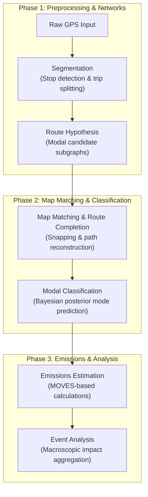

# GPS Trajectory Processing and Emissions Estimation Pipeline

This repository contains a modular Python-based pipeline designed to preprocess raw GPS trajectory datasets, perform map-matching routing on urban road networks, classify transportation modes, and estimate criteria pollutant emissions.

## Pipeline Overview

The workflow processes spatial-temporal GPS pings through the following sequential stages:



## Repository Structure

```
├── pipeline_v3/
│   ├── orchestrator.ipynb         # Main Jupyter notebook executing the modular workflow
│   ├── src/                       # Modular Python source code
│   │   ├── config.py              # Relative path and filesystem configurations
│   │   ├── segmentation.py        # Downsampling, geofencing, and trip partitioning
│   │   ├── routing.py             # Map-snapping, candidate generation, and network routing (Scenario 8 calibration)
│   │   ├── bayes_classifier.py    # Prior/posterior classification and infrastructure proximity
│   │   └── emissions.py           # MOVES emission factor matching and calculations
│   └── calibration_and_diagnostics/ # Subsystem for routing calibration, survey depuration, and bayesian tuning
│       ├── routing_algorithm_calibration/ # GPS sensitivity analysis and optimal parameters identification
│       ├── gps_survey_data_cleaning/     # Automated parsing and cleaning of manual MATLAB survey records
│       └── modes_matrices_finetuning/    # Pre-routing and decoupled Optuna hyperparameter optimization
├── legacy/                        # Legacy or baseline pipeline notebooks (e.g., V1 baseline)
├── Inputs/                        # Raw inputs (ignored by version control)
│   ├── Infrastructure/            # OpenStreetMap network graphs, Metro CSV files
│   ├── GPS User Data/             # Raw GPS parquet files & MATLAB survey datasets
│   └── Emission rates/            # MOVES emission factor tables
└── Outputs/                       # Processed results (ignored by version control)
```

## Requirements

The pipeline requires Python 3.10+ and relies on the following core libraries:
* `pandas` and `numpy` for data manipulation and vectorization
* `geopandas` and `shapely` for geographic and spatial geometry operations
* `networkx` for topological network modeling
* `python-igraph` for high-performance C-compiled shortest path search calculations
* `pyarrow` for Parquet file I/O
* `joblib` for parallel execution management

Ensure that NetworkX and iGraph cache files are pre-built and stored in `Inputs/Infrastructure/Cache_Optimizado/` to prevent initialization bottlenecks.

## Running the Pipeline

To execute the pipeline:
1. Ensure the virtual environment is active and dependencies are installed.
2. Verify that input datasets and network graphs are located in the `Inputs/` folder as configured in `pipeline_v3/src/config.py`.
3. Open the main notebook:
   ```bash
   jupyter notebook pipeline_v3/orchestrator.ipynb
   ```
4. Run all cells in the notebook. Autoreload is enabled by default to capture any updates made to the helper modules in the `src/` directory.

For routing calibration, MATLAB survey depuration, or Optuna bayesian matrices tuning, execute the scripts and follow the specifications under `pipeline_v3/calibration_and_diagnostics/`.

## Outputs

The pipeline generates two main files in `Outputs/Final Outputs/`:
* `Resultados_Datos_Emisiones_GPS_VERASET.parquet`: A tabular dataset containing the snapped nodes, speeds, classified modes of transport, and calculated emissions for each ping.
* `Resultados_Mapa_Emisiones_GPS_Kepler_VERASET.csv`: A flattened CSV format pre-formatted for direct import and time-playback visualization in Kepler.gl.

## Notes & Calibration Config

* **Timezone Assumptions**: Raw timestamps are localized to `America/Monterrey` local time.
* **Routing Calibration**: Current production parameters are calibrated under Scenario 8 (`SPATIAL_FILTER_M=15.0`, `WALK_BUFFER_M=50.0`, `DRIVE_BUFFER_M=150.0`, and default `PHYSICS_FACTOR=2.0` override).
* **Decoupled Bayes Tuning**: To optimize the Bayesian modal classifier without graph-search overhead during Optuna sweeps, routing features are precomputed using `generar_datos_entrenamiento.py` and evaluated offline in-memory.
* **Network Continuity**: Pedestrian networks (`G_walk`) can have localized topological disconnections. Gaps can be skipped dynamically via lookahead steps, which may result in localized routing failures.
* **Emissions Allocation**: Emissions for trips classified as `Bus` are prorated by a default occupancy factor of 25 to estimate passenger-level carbon footprint. Driving trips (`Carro`) calculate total vehicle-level emissions.
