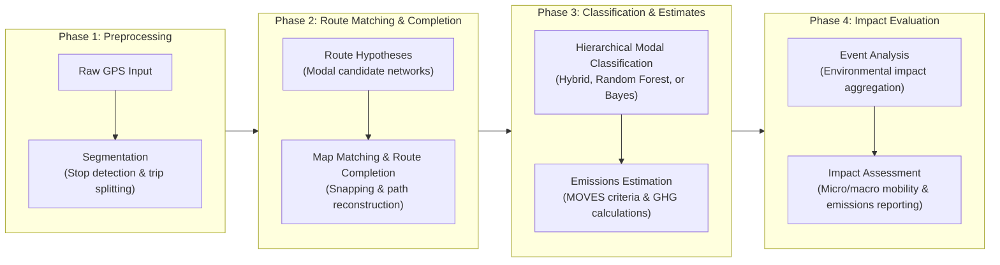

# GPS Trajectory Processing and Emissions Estimation Pipeline

This repository contains a modular Python-based pipeline designed to preprocess raw GPS trajectory datasets, perform map-matching and route reconstruction on urban transportation networks, classify transportation modes, estimate criteria pollutant and greenhouse gas (GHG) emissions, and quantify the multi-scale environmental and mobility impacts of massive public events.

## Pipeline Overview

The workflow processes spatiotemporal GPS pings through the following sequential stages:



## Repository Structure

```text
├── pipeline_v4/
│   ├── orchestrator.ipynb          # Main notebook coordinating the modular workflow
│   ├── src/                        # Production Python modules
│   │   ├── config.py               # Paths, runtime configuration, and classifier selection
│   │   ├── segmentation.py         # Downsampling, geofencing, and trip partitioning
│   │   ├── routing.py              # Map matching, candidate generation, and route completion
│   │   ├── modal_classification.py # Configurable hierarchical modal classification
│   │   ├── random_forest_contract.py # Ordered feature contracts for modal models
│   │   ├── pipeline_contracts.py   # Validation contracts between pipeline modules
│   │   └── emissions.py            # Emission-factor matching and calculations
│   └── calibration_and_diagnostics/
│       ├── routing_algorithm_calibration/ # Routing sensitivity analysis and calibration
│       ├── gps_survey_data_cleaning/      # Survey parsing, diagnostics, and cleaning
│       └── modal_classification/
│           ├── notebooks/                 # Reproducible modal-classification notebook
│           └── calibration/
│               ├── random_forest/         # Random Forest training utilities
│               ├── hybrid/                # Hybrid-cascade evaluation utilities
│               └── bayes/                 # Bayesian calibration utilities
├── tests/
│   ├── routing/                    # Routing contract tests
│   ├── modal_classification/       # Official modal-classification tests
│   ├── emissions/                  # Emissions contract tests
│   └── integration/                # End-to-end smoke tests
├── archive/                        # Historical experiments and deprecated analyses
├── Inputs/
│   ├── Infrastructure/             # OpenStreetMap graphs and routing caches
│   ├── GPS User Data/              # GPS datasets and persisted modal models
│   └── Emission rates/             # Emission-factor lookup tables
└── Outputs/                        # Generated pipeline results
```

Locally generated reports, figures, calibration artifacts, and smoke-test outputs are excluded from version control.

## Requirements

The production environment uses Python 3.12 and scikit-learn 1.5.2. The pipeline relies on the following core libraries:

* `pandas` and `numpy` for data manipulation and vectorized calculations
* `geopandas` and `shapely` for geographic and spatial operations
* `networkx` for graph representation and routing
* `python-igraph` for high-performance shortest-path calculations
* `scikit-learn` for hierarchical modal classification
* `pyarrow` for Parquet file I/O
* `joblib` for controlled parallel execution

NetworkX and iGraph cache files should be pre-built under `Inputs/Infrastructure/Cache_Optimizado/` to avoid repeated initialization costs.

## Running the Pipeline

To execute the pipeline:

1. Activate the project environment and install the required dependencies.
2. Verify that GPS data, transportation networks, model artifacts, and emission-factor tables are available under `Inputs/`.
3. Review the paths and runtime settings in `pipeline_v4/src/config.py`.
4. Open the main notebook:

   ```bash
   jupyter notebook pipeline_v4/orchestrator.ipynb
   ```

5. Run all cells in order.

Calibration and diagnostic utilities are available under `pipeline_v4/calibration_and_diagnostics/`. The official modal-classification notebook is located at:

```text
pipeline_v4/calibration_and_diagnostics/modal_classification/notebooks/playground_modal_classifier.ipynb
```

## Modal Classification

The default production model is a hierarchical hybrid classifier trained on 114 uniquely labeled physical trips and 445 Raw/L1/L2/L3 scenarios. Degraded scenarios from the same physical trip remain grouped during validation, and mixed-label trips are excluded.

The cascade consists of:

1. **N1 — Walking vs. Motorized:** `GradientBoostingClassifier` using 16 pedestrian and contrast features.
2. **N2 — Metro vs. Surface:** `RandomForestClassifier` using the official 52-feature contract.
3. **N3 — Car vs. Bus:** `ExtraTreesClassifier` using 25 features and a Bus probability threshold of 0.50.

Two previous classifiers remain available without modifying the orchestrator:

* `hybrid` — current default production classifier
* `random_forest` — previous three-level Random Forest model, retained for rollback
* `bayes` — Bayesian classifier retained as an alternative

The backend is selected through `MODAL_CLASSIFIER` in `pipeline_v4/src/config.py` or through an environment variable of the same name.

All classifiers share a quality guardrail requiring at least 15 effective pings and 30% of the original trajectory to remain after cleaning. Trips that do not satisfy these conditions return `Calidad insuficiente`.

## Outputs

The pipeline generates two primary output formats under `Outputs/Final Outputs/`:

* `Resultados_Datos_Emisiones_GPS_VERASET.parquet`: tabular route, mode, speed, and emissions results for downstream analysis.
* `Resultados_Mapa_Emisiones_GPS_Kepler_VERASET.csv`: flattened output prepared for temporal and spatial visualization in Kepler.gl.

Intermediate outputs preserve the physical trip identifier, temporal ordering, routed distances, modal result, and subsegment-level emissions whenever the corresponding stage succeeds. Pipeline failures are reported with an explicit cause rather than silently dropping trips.

## Notes & Calibration Configuration

* **Timezone assumptions:** Raw timestamps are interpreted using the configured Monterrey local timezone.
* **Routing calibration:** Current routing parameters are based on Scenario 8 (`SPATIAL_FILTER_M=15.0`, `WALK_BUFFER_M=50.0`, `DRIVE_BUFFER_M=150.0`, and the configured physics factor).
* **Network continuity:** Pedestrian networks may contain localized topological disconnections. The routing module can use bounded lookahead and fallback behavior while recording unsuccessful routes explicitly.
* **Modal reproducibility:** Runtime inference loads and validates persisted artifacts. It does not train models or overwrite production files.
* **Emissions units:** The current operational convention interprets distance-based emission rates as `g/km`, producing total grams through `g/km × km = g`. This assumption remains pending confirmation against the original MOVES export metadata.
* **Bus allocation:** Bus emissions may be prorated using the configured occupancy factor to estimate passenger-level emissions, while Car trips retain vehicle-level totals.

## Validation

The repository includes small, reusable tests for routing, modal classification, emissions, and end-to-end integration:

```bash
python -m pytest tests -q
```

The modal-classification notebook reproduces grouped out-of-fold evaluation and generates both absolute and class-normalized confusion matrices for Car, Bus, Metro, and Walking.
