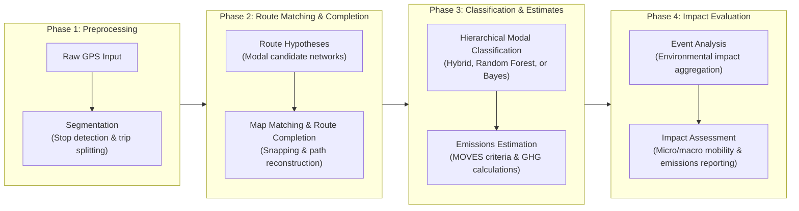

# GPS Trajectory Processing and Emissions Estimation Pipeline

This repository contains a modular Python-based pipeline designed to preprocess raw GPS trajectory datasets, perform map-matching and route reconstruction on urban transportation networks, classify transportation modes, estimate criteria pollutant and greenhouse gas (GHG) emissions, and quantify the multi-scale environmental and mobility impacts of massive public events.

The canonical architecture keeps methodological processing separate from its
inventory applications:

`Supplied VeraSet sample → preprocessing/QC + home/AGEB metadata → GPS-based routing eligibility → pipeline_v4 → individual outputs → inventory analysis`

Use `notebooks/GPS_preprocessing_and_pipeline_v4.ipynb` for the production
workflow. Downstream inventory applications consume its run-scoped outputs
through a separate handoff and are outside this processing release. The
production preprocessor never samples or replaces users. Residence confidence
does not block segmentation, routing, modal classification, or individual
emissions; `routing_eligible` is based on GPS QC, while
`home_eligible_for_inventory` records the separate residential-evidence
assessment.

## Pipeline Overview

The workflow processes spatiotemporal GPS pings through the following sequential stages:



## Repository Structure

```text
├── pipeline_v4/
│   ├── preprocessing/              # Supplied-sample QC, home inference, AGEB, metadata
│   ├── src/                        # Production Python modules
│   │   ├── config.py               # Paths, runtime configuration, and classifier selection
│   │   ├── segmentation.py         # Downsampling, geofencing, and trip partitioning
│   │   ├── routing.py              # Map matching, candidate generation, and route completion
│   │   ├── endpoint_routing.py     # V2 real-edge endpoint preservation
│   │   ├── modal_classification.py # Configurable hierarchical modal classification
│   │   ├── random_forest_contract.py # Ordered feature contracts for modal models
│   │   ├── pipeline_contracts.py   # Validation contracts between pipeline modules
│   │   ├── production_workflow.py  # Callable route/mode/emissions orchestration
│   │   ├── run_workflow.py         # Run ID, scoped outputs, and root manifest
│   │   └── emissions.py            # Emission-factor matching and calculations
│   └── calibration_and_diagnostics/
│       ├── legacy_routing/                # V1-compatible rollback implementation
│       └── modal_classification/
│           ├── artifacts/                 # Versioned production serving artifacts
│           ├── notebooks/                 # Reproducible classifier validation
│           └── calibration/               # Required model-contract sources
├── tests/
│   ├── routing/                    # Routing contract tests
│   ├── modal_classification/       # Official modal-classification tests
│   ├── emissions/                  # Emissions contract tests
│   └── integration/                # End-to-end smoke tests
├── notebooks/
│   └── GPS_preprocessing_and_pipeline_v4.ipynb
├── Inputs/
│   ├── Infrastructure/             # OpenStreetMap graphs and routing caches
│   ├── GPS User Data/              # Local GPS datasets (not versioned)
│   └── Emission rates/             # Emission-factor lookup tables
└── Outputs/runs/<run_id>/          # Isolated preprocessing/pipeline outputs per run
```

Reusable route hypotheses produced by modal-classifier calibration are derived
artifacts and live under
`Outputs/calibration_cache/modal_classification/route_hypotheses/`; they are not
raw GPS inputs and are excluded from version control. They may be regenerated
from the calibration workflow when needed.

Locally generated reports, figures, calibration artifacts, and smoke-test outputs are excluded from version control.

## Requirements

The production environment uses Python 3.12 and scikit-learn 1.5.2. Exact
production dependency versions are pinned in `requirements-production.txt`,
and the canonical workflow validates the Python and scikit-learn versions at
runtime before loading the persisted classifier. The pipeline relies on the
following core libraries:

* `pandas` and `numpy` for data manipulation and vectorized calculations
* `geopandas` and `shapely` for geographic and spatial operations
* `networkx` for graph representation and routing
* `python-igraph` for high-performance shortest-path calculations
* `scikit-learn` for hierarchical modal classification
* `pyarrow` for Parquet file I/O
* `joblib` for controlled parallel execution

NetworkX and iGraph cache files should be pre-built under `Inputs/Infrastructure/Cache_Optimizado/` to avoid repeated initialization costs.

## Running the Pipeline

For the integrated supplied-sample workflow:

1. Activate the project environment and install the required dependencies.
2. Place the supplied GPS Parquet under `Inputs/GPS User Data/` and the matching
   AGEB boundary file under `Inputs/Infrastructure/AGEB/`. Build or copy the
   local transportation-network caches under
   `Inputs/Infrastructure/Cache_Optimizado/`. These external inputs are not
   versioned. The serving models and emission-factor table are included.
3. Review the paths in `notebooks/GPS_preprocessing_and_pipeline_v4.ipynb`
   and the runtime settings in `pipeline_v4/src/config.py`. Production defaults
   to `ROUTER_VERSION=v2`; set `ROUTER_VERSION=v1` only for the stable rollback.
4. Open the processing notebook:

   ```bash
   jupyter notebook notebooks/GPS_preprocessing_and_pipeline_v4.ipynb
   ```

5. Set `EXECUTE_PRODUCTION_RUN=True` after reviewing the paths. Choose
   `OUTPUT_MODE = "summary"`, `"detailed"`, or `"both"` in the notebook.
   The canonical production worker setting is `N_JOBS=2`.
   The callable workflow creates a unique run ID and writes the selected
   English-schema route/emissions output, `trip_ledger.parquet`, and
   `manifest.json` under that run only.

The root-level `notebooks/` directory is intentional: it contains user/research
interfaces, while `pipeline_v4/` contains importable production modules.

The versioned modal-classification validation notebook is located at:

```text
pipeline_v4/calibration_and_diagnostics/modal_classification/notebooks/playground_modal_classifier.ipynb
```

## Modal Classification

The default production model is a hierarchical hybrid classifier trained on 114 uniquely labeled physical trips and 445 Raw/L1/L2/L3 scenarios. Degraded scenarios from the same physical trip remain grouped during validation, and mixed-label trips are excluded.

The cascade consists of:

1. **N1 — Walking vs. Motorized:** `GradientBoostingClassifier` using 16 pedestrian and contrast features.
2. **N2 — Metro vs. Surface:** `RandomForestClassifier` using the official 52-feature contract.
3. **N3 — Car vs. Bus:** `ExtraTreesClassifier` using 25 features and a Bus probability threshold of 0.50.

Two previous classifiers remain available without modifying the orchestrator:

* `hybrid` — current default production classifier
* `random_forest` — previous three-level Random Forest model, retained for rollback
* `bayes` — Bayesian classifier retained as an alternative

The backend is selected through `MODAL_CLASSIFIER` in `pipeline_v4/src/config.py` or through an environment variable of the same name.

All classifiers use a pre-routing guardrail requiring at least 15 effective
pings and 30% of the original trajectory to remain after cleaning. This is an
evidence/serving-contract guardrail, not a claim that every retained route is
complete; post-routing completeness is recorded separately.

## Outputs

Every production execution writes an isolated directory under
`Outputs/runs/<run_id>/`:

* `preprocessing/user_home_metadata.parquet` and optional `preprocessed_gps.parquet`;
* `pipeline/routes_emissions_summary.parquet` for normal analysis and/or
  `routes_emissions_detailed.parquet` for audit, plus `trip_ledger.parquet`;
* `manifest.json` with configuration, software, artifact, and Git metadata.

`Outputs/Final Outputs/` contains historical shared outputs and is not the V4
production destination. It is retained for archival compatibility.

Intermediate outputs preserve the physical trip identifier, temporal ordering, routed distances, modal result, and subsegment-level emissions whenever the corresponding stage succeeds. Pipeline failures are reported with an explicit cause rather than silently dropping trips.

The summary schema is intended for analysis and visualization. It contains
canonical English identifiers, local time, `kepler_time`, coordinates, route
geometry, transport mode, emissions and concise residence metadata.
`kepler_time` is a deterministic `YYYY-MM-DD HH:MM:SS` visualization helper
derived from `local_timestamp`; the latter remains the canonical timestamp.
The detailed schema adds routing, quality, component and lookup audit fields.
`trip_ledger.parquet` records one quality and processing outcome per trip.

## Notes & Calibration Configuration

* **Timestamp contract:** Input timestamps must represent UTC. Unix timestamps
  are UTC; timezone-aware values are converted from their declared instant;
  naive values are interpreted as UTC. Processing then converts them to
  `America/Monterrey` local time.
* **Input coverage:** Configure the supplied acquisition interval as half-open
  `[coverage_start, coverage_end)`. Only local edge days proven partial by
  that interval are excluded. Without reliable coverage metadata, edge days
  are retained and marked with `day_completeness_status="unknown"`.
* **Home evidence:** The default is `HOME_MIN_NIGHTS=3`. Setting it to `None`
  permits lax candidate assessment but never promotes a one-night candidate to
  probable/reliable; routing remains independent of either setting.
* **Routing calibration:** Current routing parameters are based on Scenario 8 (`SPATIAL_FILTER_M=15.0`, `WALK_BUFFER_M=50.0`, `DRIVE_BUFFER_M=150.0`, and the configured physics factor).
* **Production router:** `v2` adds independently validated endpoint candidate
  expansion, real-edge partial snapping, bounded lookahead, and explicit
  uncovered/reject status. `v1` remains the rollback implementation.
* **Candidate availability:** Production map matching uses the nearest edge and
  exact-distance ties within the configured search radius. Diagnostic studies
  found that additional candidates can improve isolated routes, but greedy
  local selection can also reduce global route consistency. Multi-candidate
  sequence scoring therefore remains a calibration topic and is not required
  for production operation.
* **Network continuity:** Pedestrian networks may contain localized topological disconnections. The routing module can use bounded lookahead and fallback behavior while recording unsuccessful routes explicitly.
* **Modal reproducibility:** Runtime inference loads and validates persisted artifacts. It does not train models or overwrite production files.
* **Emissions schema:** rates use fields such as `co2_g_km` and totals use
  fields such as `co2_total_g`.
* **Bus allocation:** Bus emissions may be prorated using the configured occupancy factor to estimate passenger-level emissions, while Car trips retain vehicle-level totals.

## Validation

The repository includes small, reusable tests for routing, modal classification, emissions, and end-to-end integration:

```bash
python -m pytest tests -q
```

The modal-classification notebook reproduces grouped out-of-fold evaluation and generates both absolute and class-normalized confusion matrices for Car, Bus, Metro, and Walking.
