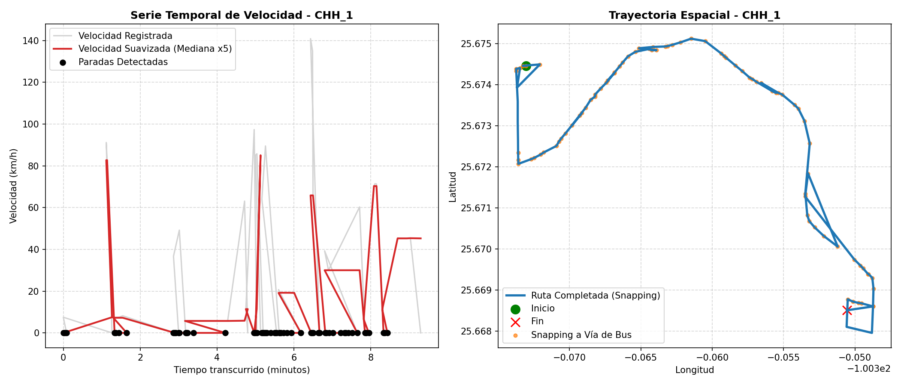
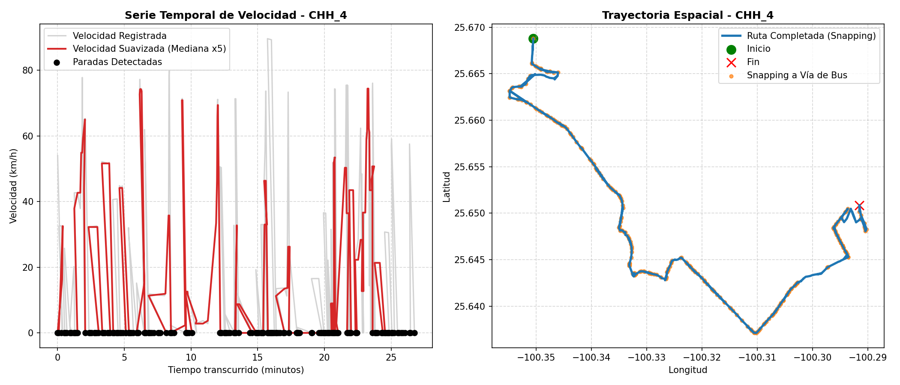
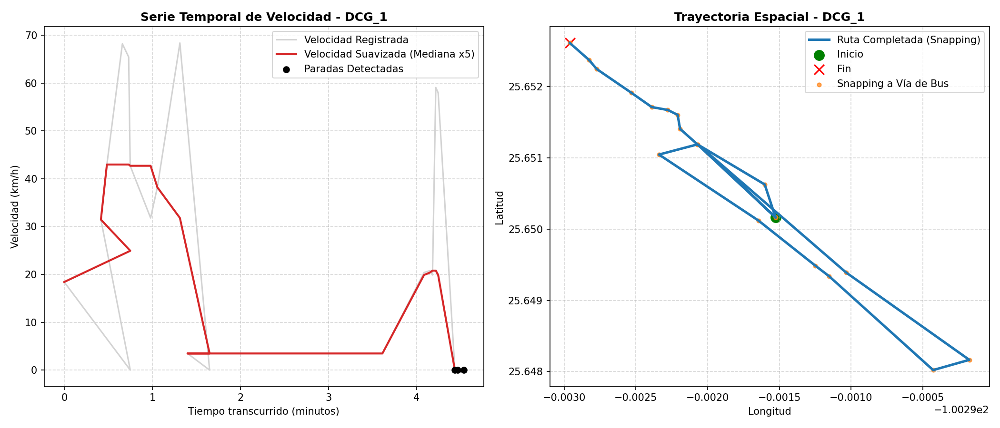
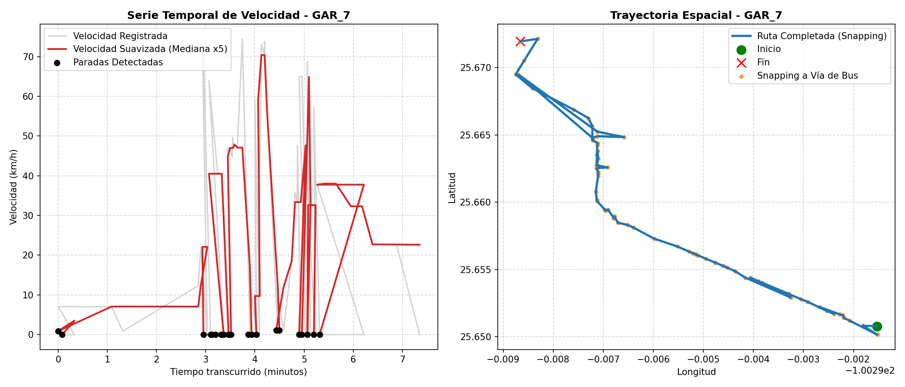

# Auditoría de Viajes en Autobús con Errores Persistentes y Dataset Canónico

Este documento presenta una auditoría forense rigurosa sobre los errores en viajes de autobús (`CHH_1`, `CHH_4`, `DCG_1`, `GAR_7`) entrenando estrictamente sobre el **dataset canónico de 4 clases** (excluyendo viajes mixtos o con marcas vacías).

---

## 1. Métricas Comparativas del Grupo Auditado (ML_v4_bus_features)

A continuación se muestra el desglose cinemático y predictivo de cada escenario auditado. Las métricas físicas de esta tabla y los diagnósticos de la sección 2 se leen directamente del mismo DataFrame unificado para garantizar consistencia absoluta:

| Viaje | Deg | Clase Real | Predicción | Prob Carro | Prob Bus | Pings | Distancia (m) | Conservado % | Clasificación de Error |
| :--- | :---: | :---: | :---: | :---: | :---: | :---: | :---: | :---: | :--- |
| **CHH_1** | L1 | Bus (Mixto) | `Carro` | 69.34% | 30.66% | 22 | 3564 | 99.74% | **Etiqueta sospechosa** |
| **CHH_1** | L2 | Bus (Mixto) | `Carro` | 74.99% | 25.01% | 5 | 3554 | 99.74% | **Etiqueta sospechosa** |
| **CHH_1** | L3 | Bus (Mixto) | `Carro` | 61.05% | 38.95% | 2 | 3345 | 99.74% | **Etiqueta sospechosa** |
| **CHH_1** | Raw | Bus (Mixto) | `Carro` | 68.91% | 31.09% | 174 | 4062 | 99.74% | **Etiqueta sospechosa** |
| **CHH_4** | L1 | Bus | `Carro` | 85.75% | 14.25% | 76 | 12368 | 99.75% | **Señal insuficiente** |
| **CHH_4** | L2 | Bus | `Carro` | 87.08% | 12.92% | 17 | 11944 | 99.75% | **Señal insuficiente** |
| **CHH_4** | L3 | Bus | `Carro` | 59.19% | 40.81% | 4 | 10586 | 99.75% | **Señal insuficiente** |
| **CHH_4** | Raw | Bus | `Carro` | 75.66% | 24.34% | 561 | 12494 | 99.75% | **Señal insuficiente** |
| **DCG_1** | L1 | Bus (Mixto) | `Bus` | 48.73% | 51.27% | 7 | 1218 | 28.13% | **Daño por limpieza** |
| **DCG_1** | L2 | Bus (Mixto) | `Bus` | 44.28% | 55.72% | 5 | 1083 | 28.13% | **Daño por limpieza** |
| **DCG_1** | L3 | Bus (Mixto) | `Carro` | 76.14% | 23.86% | 2 | 226 | 28.13% | **Daño por limpieza** |
| **DCG_1** | Raw | Bus (Mixto) | `Bus` | 44.59% | 55.41% | 19 | 1218 | 28.13% | **Daño por limpieza** |
| **GAR_7** | L1 | Bus | `Carro` | 57.98% | 42.02% | 18 | 2850 | 97.72% | **Viaje corto** |
| **GAR_7** | L2 | Bus | `Carro` | 52.69% | 47.31% | 4 | 2630 | 97.72% | **Viaje corto** |
| **GAR_7** | L3 | Bus | `Carro` | 57.16% | 42.84% | 2 | 2620 | 97.72% | **Viaje corto** |
| **GAR_7** | Raw | Bus | `Carro` | 60.62% | 39.38% | 127 | 2960 | 97.72% | **Viaje corto** |

---

## 2. Diagnóstico Individual del Comportamiento Físico (Nivel Raw)

### 2.1 Viaje CHH_1 (Clasificación: Etiqueta sospechosa - Excluido por etiqueta mixta)
*   **Diagnóstico:** El viaje está etiquetado como `Bus` en el Ground Truth, pero registra velocidades máximas de autopista superiores a **140.87 km/h** con **1.4768 ciclos de parada por kilómetro**. Los tiempos de arranque y aceleración son idénticos a los de un vehículo privado ágil. En el archivo MATLAB original posee marcas de tiempo tanto para `carro` como para `bus`, marcándolo como **etiqueta mixta** y excluyéndolo del entrenamiento canónico de 4 clases.
*   **Detalles Físicos (Lectura Dinámica):**
    *   **Duración:** 558 segundos (~9 minutos).
    *   **Distancia:** 4062 metros.
    *   **Pings Efectivos:** 174 pings.
    *   **Velocidad Media:** 19.99 km/h.
    *   **Porcentaje Conservado:** 99.74%.
*   **Conclusión:** Se trata de una etiqueta errónea en el Ground Truth. El modelo clasifica correctamente al llamarlo `Carro`.

---

### 2.2 Viaje CHH_4 (Clasificación: Señal insuficiente)
*   **Diagnóstico:** Este viaje en autobús ocurre en una ruta de alta velocidad (periférico/carretera primaria) a velocidad constante (mediana de ~38 km/h, max de 89.62 km/h) con **175 micro-paradas artificiales detectadas debido a la fluctuación de velocidad del GPS**. OSM muestra 0% de cobertura de rutas de autobús para esa sección.
*   **Detalles Físicos (Lectura Dinámica):**
    *   **Duración:** 1605 segundos (~26 minutos).
    *   **Distancia:** 12494 metros.
    *   **Pings Efectivos:** 561 pings.
    *   **Velocidad Media:** 18.91 km/h.
    *   **Porcentaje Conservado:** 99.75%.
*   **Conclusión:** La firma cinemática del viaje es físicamente idéntica a la de un vehículo privado. Al no poseer paraderos o snapping espacial de bus, el modelo lo clasifica como `Carro`.

---

### 2.3 Viaje DCG_1 (Clasificación: Daño por limpieza - Excluido por etiqueta mixta)
*   **Diagnóstico:** El proceso de limpieza de MATLAB redujo drásticamente el viaje, conservando únicamente el **28.13%** de los datos brutos (pasando de 1,439 pings originales a 19 pings efectivos en Raw). Posee marcas tanto de `caminar` como de `bus`, siendo clasificado como **etiqueta mixta**.
*   **Detalles Físicos (Lectura Dinámica):**
    *   **Duración:** 272 segundos (~4.5 minutos).
    *   **Distancia:** 1218 metros.
    *   **Pings Efectivos:** 19 pings.
    *   **Velocidad Media:** 28.21 km/h.
    *   **Porcentaje Conservado:** 28.13%.
*   **Conclusión:** El filtrado destructivo eliminó la firma de paradas y segmentó el viaje en tramos de velocidad constante, eliminando la firma cinemática temporal del autobús.

---

### 2.4 Viaje GAR_7 (Clasificación: Viaje corto)
*   **Diagnóstico:** Viaje de apenas 441 segundos (alrededor de 7 minutos) y 2960 metros con solo 127 pings en la versión Raw, que decrece a 2 pings en L3.
*   **Detalles Físicos (Lectura Dinámica):**
    *   **Duración:** 441 segundos (~7 minutos).
    *   **Distancia:** 2960 metros.
    *   **Pings Efectivos:** 127 pings.
    *   **Velocidad Media:** 25.75 km/h.
    *   **Porcentaje Conservado:** 97.72%.
*   **Conclusión:** Al ser tan corto, no llega a desarrollar el comportamiento periódico de paradas/arranques del autobús, asemejándose a un tramo corto de carro privado.

---

## 3. Estructura y Estadísticas del Dataset Canónico

Al agrupar y consolidar los datos para poseer **una sola fila por trayectoria física y una sola etiqueta**, logramos eliminar el ruido de etiquetas duplicadas:

*   **Total de trayectorias físicas únicas en MATLAB:** 139
*   **Viajes excluidos por etiquetas vacías:** 0
*   **Viajes excluidos por etiquetas mixtas (15):** ['AAV_2', 'AQR_1', 'CHH_1', 'CHH_14', 'DCG_1', 'DCG_3', 'DEDO_4', 'DEPO_4', 'DMR_1', 'EEHS_1', 'FJBC_2', 'GAR_4', 'GOH_4', 'JAMR_12', 'MCA_4']
*   **Trayectorias canónicas retenidas:** 124 (124 viajes)
    *   *Distribución:* Carro: 91 | Caminar: 15 | Bus: 12 | Metro: 6.
*   **Escenarios en cache que corresponden a trayectorias canónicas:** 264

---

## 4. Validación Repetida (StratifiedGroupKFold - 20 Splits)

Para someter a ambos modelos a una comparación estadística rigurosa, corrimos un esquema de **20 splits de StratifiedGroupKFold** sobre el dataset canónico de 124 viajes:

| Métrica | ML_v4_actual (Control - 49 vars) | ML_v4_bus_features (Exp - 55 vars) | Diferencia Pareada |
| :--- | :---: | :---: | :---: |
| **Balanced Accuracy Media** | **86.15%** ± 15.37% | **85.73%** ± 13.13% | **-0.42%** |
| **Macro F1-Score Medio** | **75.91%** | **75.73%** | **-0.18%** |
| **Recall de Autobús Medio** | **41.25%** | **40.00%** | **-1.25%** |
| **Porcentaje de Folds Ganados** | *N/A* | *N/A* | **10.0%** |

### Análisis Estadístico
*   El modelo experimental `ML_v4_bus_features` (55 variables) **no muestra un desempeño superior consistente**. De hecho, experimenta un ligero **deterioro de -0.42%** en Balanced Accuracy y un **deterioro de -1.25%** en el Recall medio de Autobús, ganando en tan solo el **10%** de las particiones (2 de 20 folds).
*   **Decisión de Reversión:** Debido a que las 6 nuevas variables no aportan una mejora general consistente y aumentan la variabilidad en los subconjuntos del cross-validation, **hemos eliminado esas variables de producción y congelado el pipeline bajo el clasificador ML_v4_actual (49 variables)**.

---

## 5. Análisis de la Regla de Calidad (Secundario / Producción)

Mantenemos la regla de calidad (`pings >= 15` y `conserved >= 30%`) exclusivamente como un **filtro de producción** para rechazar estimaciones físicas de baja calidad, no para inflar el desempeño reportado:

*   **Escenarios canónicos totales:** 264
*   **Escenarios que aprueban la regla de calidad:** 133 (se devuelve *Calidad Insuficiente* en el resto).
